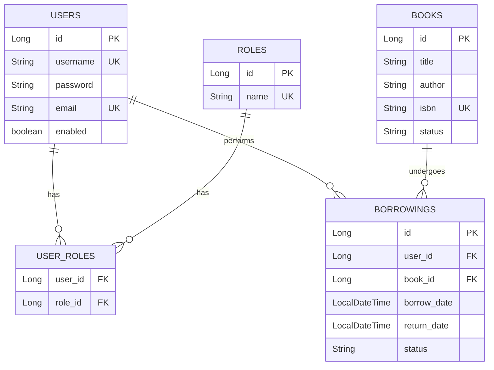
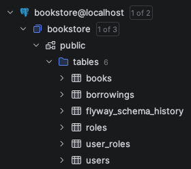
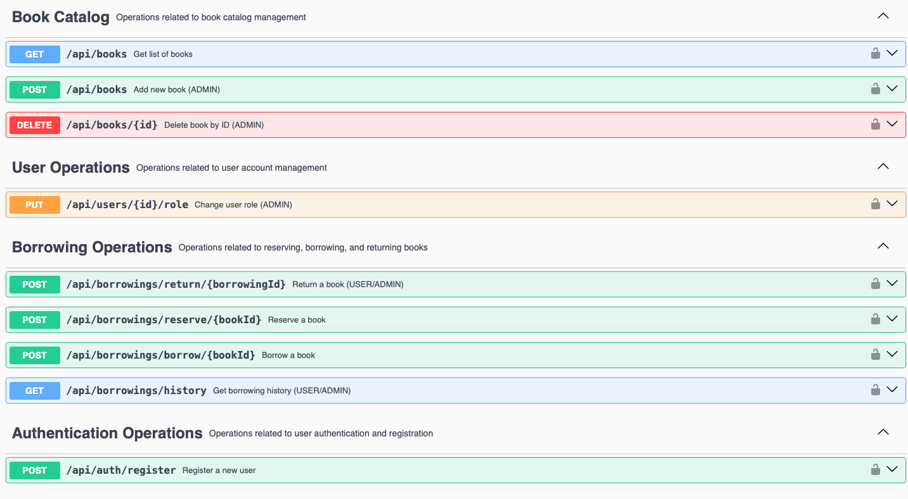
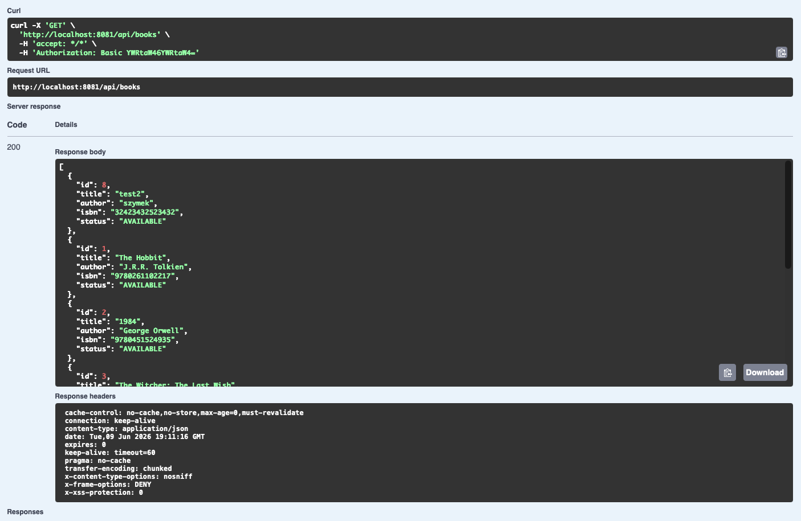
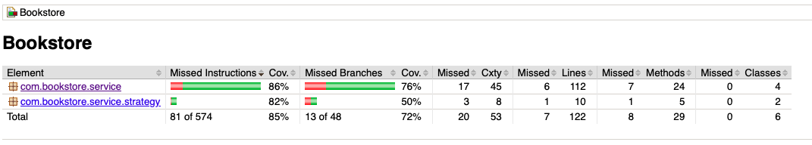

# Bookstore App - Projekt Zaliczeniowy

Projekt zaliczeniowy z programowania w języku Java (Spring Boot).

## Autor
* **Szymon Lottig**

---

## 1. Opis i cel projektu

Projekt Bookstore App to aplikacja backendowa imitująca działanie systemu bibliotecznego lub księgarni. Umożliwia ona zarządzanie zasobami książek, ich rezerwowanie, wypożyczanie oraz zwracanie. System rozróżnia uprawnienia zalogowanego użytkownika (zwykły czytelnik vs administrator) i na tej podstawie nakłada odpowiednie limity oraz pozwala na wykonanie określonych akcji biznesowych.

Aplikacja jest w pełni skonteneryzowana przy użyciu Dockera.

---

## 2. Baza Danych

Aplikacja korzysta z relacyjnej bazy danych PostgreSQL. Schemat bazy danych składa się z 5 tabel połączonych relacjami:
* `users` – dane zarejestrowanych użytkowników.
* `roles` – role dostępne w systemie (ROLE_USER, ROLE_ADMIN).
* `user_roles` – tabela łącząca (wielu-do-wielu) użytkowników z ich rolami.
* `books` – katalog książek ze statusem (AVAILABLE, RESERVED, BORROWED).
* `borrowings` – historia operacji rezerwacji, wypożyczeń i zwrotów.

### Diagram ERD (Entity Relationship Diagram)
Poniższy schemat przedstawia strukturę tabel oraz relacje między nimi:



### Fizyczna struktura tabel w bazie danych
Poniższy zrzut ekranu potwierdza poprawne wygenerowanie tabel w bazie PostgreSQL przez migracje Flyway:


---

## 3. Prezentacja działania REST API

Aplikacja wystawia interfejs REST API, który został zabezpieczony za pomocą modułu Spring Security przy użyciu protokołu HTTP Basic Authentication. Dostęp do określonych ścieżek zależy od przypisanej użytkownikowi roli (ROLE_USER / ROLE_ADMIN).

### Instrukcja szybkiego uruchomienia projektu (Docker)
1. Przejdź w terminalu do folderu aplikacji:
   ```bash
   cd ProjectBookstoreApp
   ```
2. Uruchom budowanie i start kontenerów:
   ```bash
   docker-compose up --build
   ```
3. Aplikacja i baza danych zostaną uruchomione automatycznie.

### Dokumentacja API (Swagger UI)
Wszystkie endpointy zostały udokumentowane w języku angielskim za pomocą biblioteki Springdoc OpenAPI. Interfejs Swaggera jest dostępny po uruchomieniu pod adresem: http://localhost:8081/swagger-ui/index.html

Dane logowania do testów:
* Administrator: login `admin`, hasło `admin`
* Użytkownik: login `user`, hasło `qwerty1`

Poniższy zrzut ekranu przedstawia udokumentowane endpointy w Swagger UI:


### Wykaz endpointów API

| Metoda | Ścieżka (Endpoint) | Rola (Dostęp) | Opis |
| :--- | :--- | :--- | :--- |
| **POST** | `/api/auth/register` | Publiczny | Rejestracja nowego konta czytelnika |
| **GET** | `/api/books` | Publiczny | Przeglądanie i filtrowanie książek |
| **POST** | `/api/books` | ADMIN | Dodawanie nowej książki do katalogu |
| **DELETE** | `/api/books/{id}` | ADMIN | Usuwanie książki z bazy danych |
| **PUT** | `/api/users/{id}/role` | ADMIN | Zmiana roli użytkownika (np. na admina) |
| **POST** | `/api/borrowings/reserve/{bookId}` | USER / ADMIN | Rezerwowanie książki (limit 5 dla USER) |
| **POST** | `/api/borrowings/borrow/{bookId}` | USER / ADMIN | Wypożyczenie bezpośrednie lub z rezerwacji |
| **POST** | `/api/borrowings/return/{borrowingId}` | USER / ADMIN | Zwrot książki (własnej lub cudzej przez admina) |
| **GET** | `/api/borrowings/history` | USER / ADMIN | Historia wypożyczeń (własna lub globalna dla admina) |

### Przykład wywołania API
Poniższy zrzut ekranu przedstawia poprawną odpowiedź z serwera po wywołaniu jednego z endpointów:


---

## 4. Testowanie i Jakość Kodu

W celu weryfikacji poprawności działania logiki biznesowej, napisaliśmy zestaw testów jednostkowych (JUnit 5 + Mockito). Pozwalają one na pełne przetestowanie warstwy serwisowej bez konieczności uruchamiania bazy danych.

Aby odpalić testy jednostkowe i wygenerować raport pokrycia kodu:
```bash
cd ProjectBookstoreApp
./mvnw clean test jacoco:report
```

### Wykluczenia w JaCoCo
W pliku pom.xml skonfigurowaliśmy wykluczenia (excludes) dla klas, które nie zawierają logiki biznesowej:
* Klasy modeli (encje JPA) oraz obiekty DTO (zawierają jedynie pola oraz gettery/settery Lomboka – testowanie ich jednostkowo byłoby sprawdzaniem poprawności zewnętrznej biblioteki, a nie kodu aplikacji).
* Klasy konfiguracyjne (Spring Security, konfiguracja Swaggera, główna klasa uruchomieniowa) – są deklaracjami dla Springa i ich badanie testem jednostkowym nie ma przełożenia na logikę biznesową.

Dzięki wykluczeniom, JaCoCo bada jakość kodu tam, gdzie rzeczywiście znajduje się logika (serwisy i strategie limitów), co daje rzetelne i wysokie pokrycie.

Poniższy zrzut ekranu przedstawia raport pokrycia kodu JaCoCo (index.html) na poziomie powyżej wymaganych 80%:

